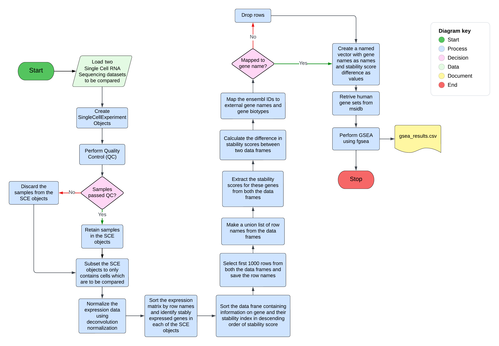
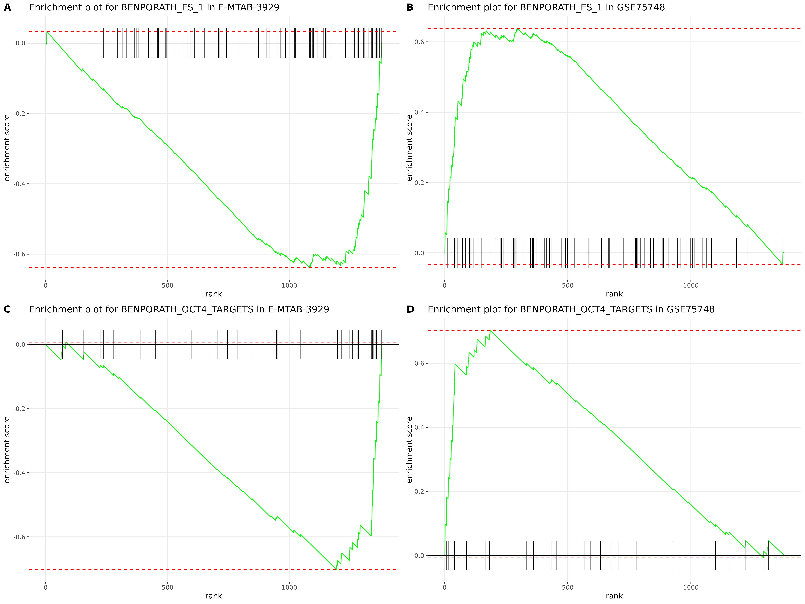
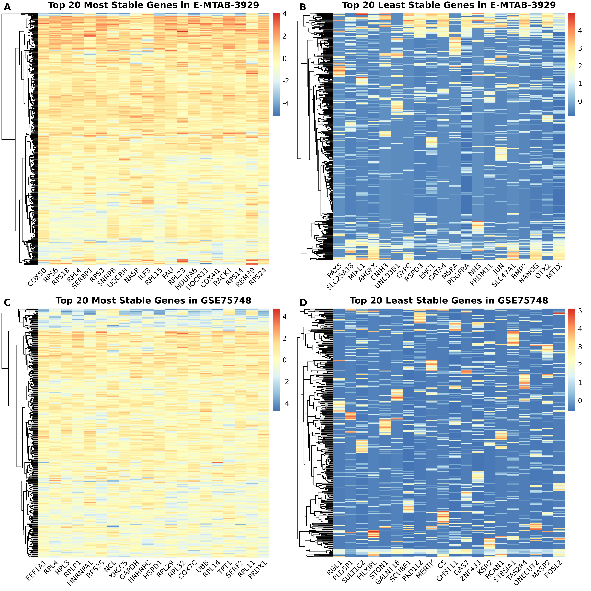

# SMART-Seq2 Single-Cell RNA-Seq Analysis Pipeline
[](https://www.r-project.org/)
[](https://en.wikipedia.org/wiki/Bioinformatics)
[](https://opensource.org/licenses/MIT)

An end-to-end bioinformatics pipeline for processing and analyzing single-cell RNA sequencing data. This project implements a novel **Differential Stability Analysis** algorithm (based on scMerge) to identify changes in Stably Expressed Genes (SEGs) that characterize human embryonic development.


*Figure 1: Flowchart of the novel algorithm to detect stability changes in SEGs at different stages of human development.*

---

## Key Highlights
- **Full Lifecycle Implementation:** Engineered a complete bioinformatics workflow from raw sequencing reads (FASTQ) to publication-quality biological interpretations.
- **Novel Methodology:** Implemented a "stability-first" algorithm (based on scMerge) that identifies genes with consistent expression patterns, providing a more robust alternative to traditional differential expression in noisy scRNA-seq data.
- **Project Outcome:** Validated the stability of pluripotency master regulators (OCT4, NANOG) in hESCs and tracked their destabilization during early cell-state transitions.

## Technical Stack
- **Languages:** R (Tidyverse, Bioconductor), Bash, Python.
- **Upstream Processing:** FastQC, Trimmomatic, STAR (Alignment), featureCounts.
- **Downstream Analysis:** Seurat (v5), scran, scater, scMerge, FGSEA.
- **Environment:** Managed via Conda/Mamba for 100% reproducibility.

---

## Results
### Gene Set Enrichment Analysis Reveals Changes in Stability of Genes Related to Pluripotency

This pipeline used the FGSEA package from the Bioconductor ecosystem to perform gene set enrichment analysis using the top 1,000 most stable genes from the dataset. Panels B and D show strong positive enrichment of gene sets containing pluripotency-associated genes in the human embryonic stem cell population (H9 cell line; GSE75748), whereas panels A and C show clear depletion/downregulation of these same gene sets as cells transition toward a more differentiated developmental state (day 7 cells from E-MTAB-3929).


*Figure 3: Gene set enrichment analysis showing pluripotency-associated gene sets transitioning from positively enriched states in human embryonic stem cells (GSE75748; panels B and D) to negatively enriched/downregulated states during early differentiation (E-MTAB-3929; panels A and C).*

### Heatmap of the most and least stable genes identified in the datasets.
These heatmaps show the expression patterns of the top 20 most stable and least stable genes across individual cells in both datasets. The most stable genes exhibit relatively consistent expression patterns across cells, indicating lower transcriptional variability, whereas the least stable genes display substantially greater heterogeneity between cells. This contrast highlights differences in gene expression stability across developmental states and demonstrates how transcriptional variability changes between pluripotent stem cells (GSE75748) and differentiated day 7 cells (E-MTAB-3929). Additionally, as seen in panel C, the identification of **GAPDH**, a well-known housekeeping gene, as one of the most stable genes in that dataset further supports the methodology used by the scMerge package to identify stably expressed genes (SEGs). However, the absence of the same gene in the other dataset serves as a reminder that genes traditionally considered stable at the bulk or population level may not necessarily remain stable at the single-cell level.



*Figure 4: Heatmap showing expression patterns of most and least stable genes across cell types in the datasets.*

---

## Project Structure
- `01_enviroment-setup/`: Reproducible Conda environments.
- `03_analysis-pipelines/`: Modular R and Bash scripts for upstream and downstream processing.
- `00_documentation/`: In-depth background on the biological context and methodology.
- `Final_Plots/`: Complete repository of high-resolution analytical visualizations.

## Quick Start
1. **Setup Environments:**
   ```bash
   # For Downstream Processing (From generated counts matrix to downstream implementation of the algorithm)
   conda env create -f 01_enviroment-setup/conda/enviroment_downstream.yaml
   conda activate plate-based-scrnaseq_downstream

   # For Upstream Processing (From FASTQ files to counts matrix)
   conda env create -f 01_enviroment-setup/conda/enviroment_upstream.yaml
   conda activate plate-based-scrnaseq_upstream
   ```
2. **Run Analysis:**
   ```bash
   # For upstream processing
   # Each bash code chunk from "03_analysis-pipelines/01_upstream-analysis/pre-processing-pipeline.Rmd" was ran on the terminal seperately.


   # For downstream analysis
   cd 03_analysis-pipelines/02_downstream-analysis
   Rscript revised-human-seg-algorithm.R
   ```

---
**Author:** Sourav Roy  
*MSc Data Science for Biology (2024), University of Edinburgh*
